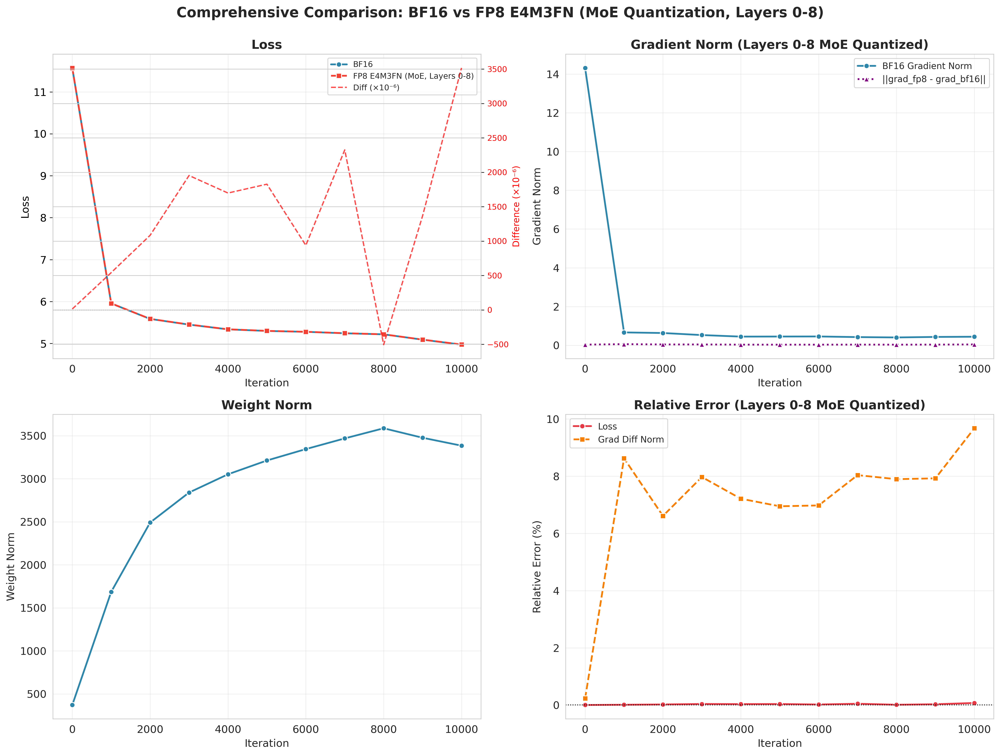
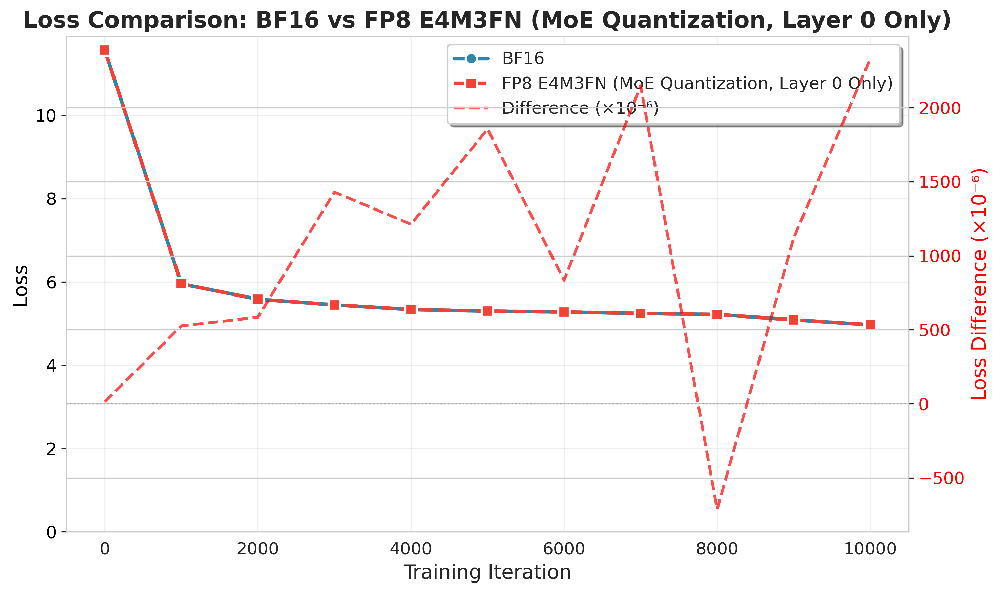
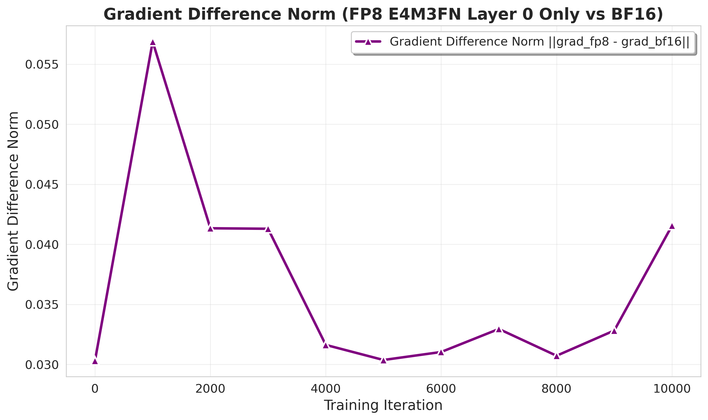
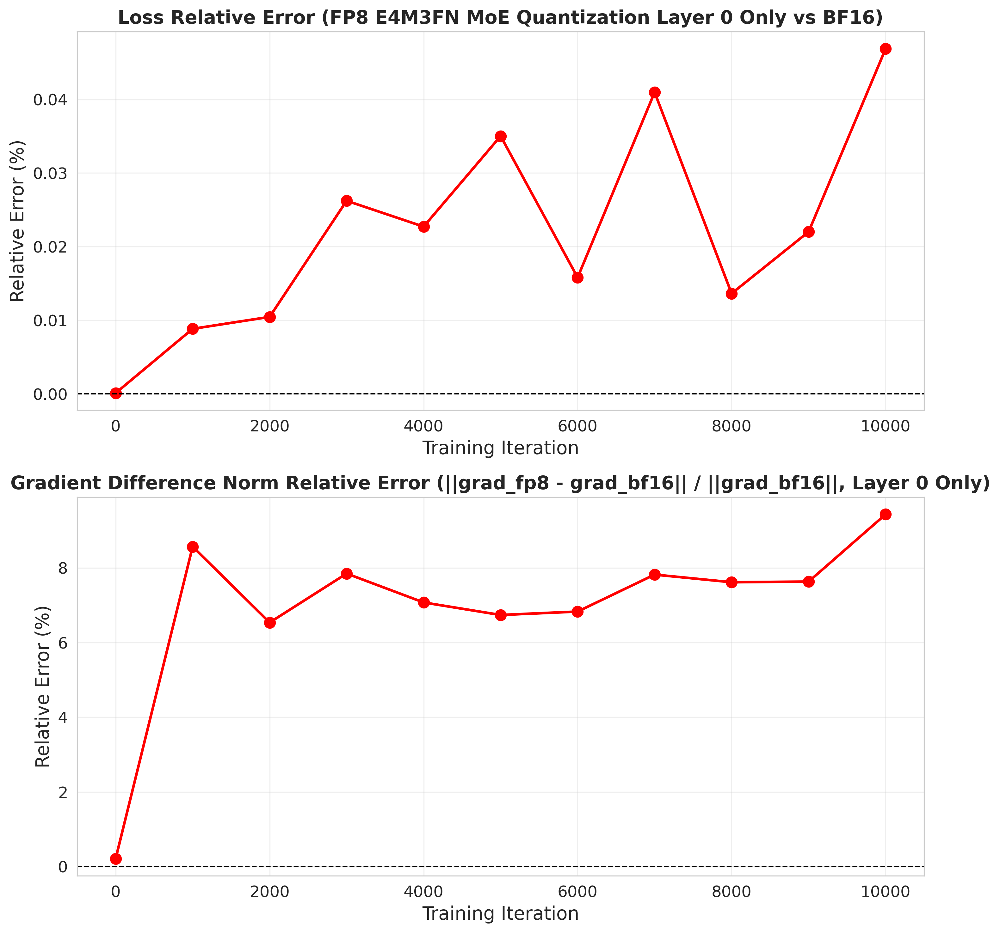
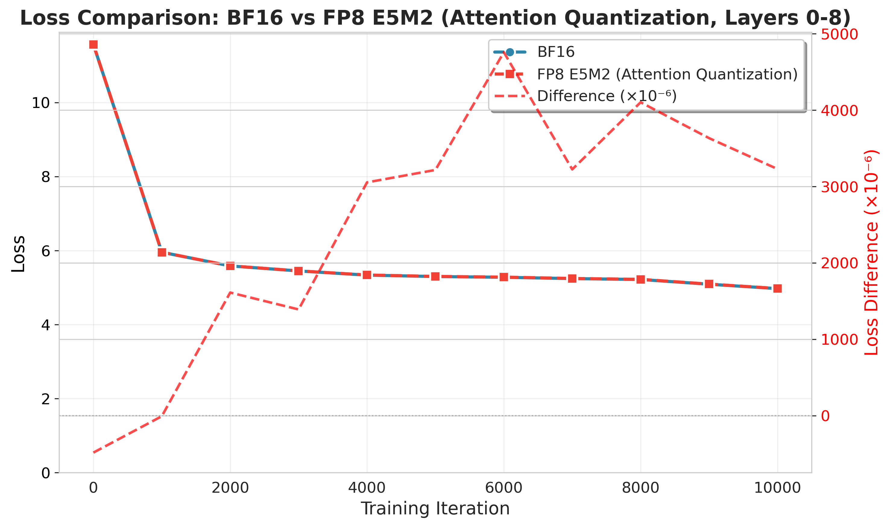
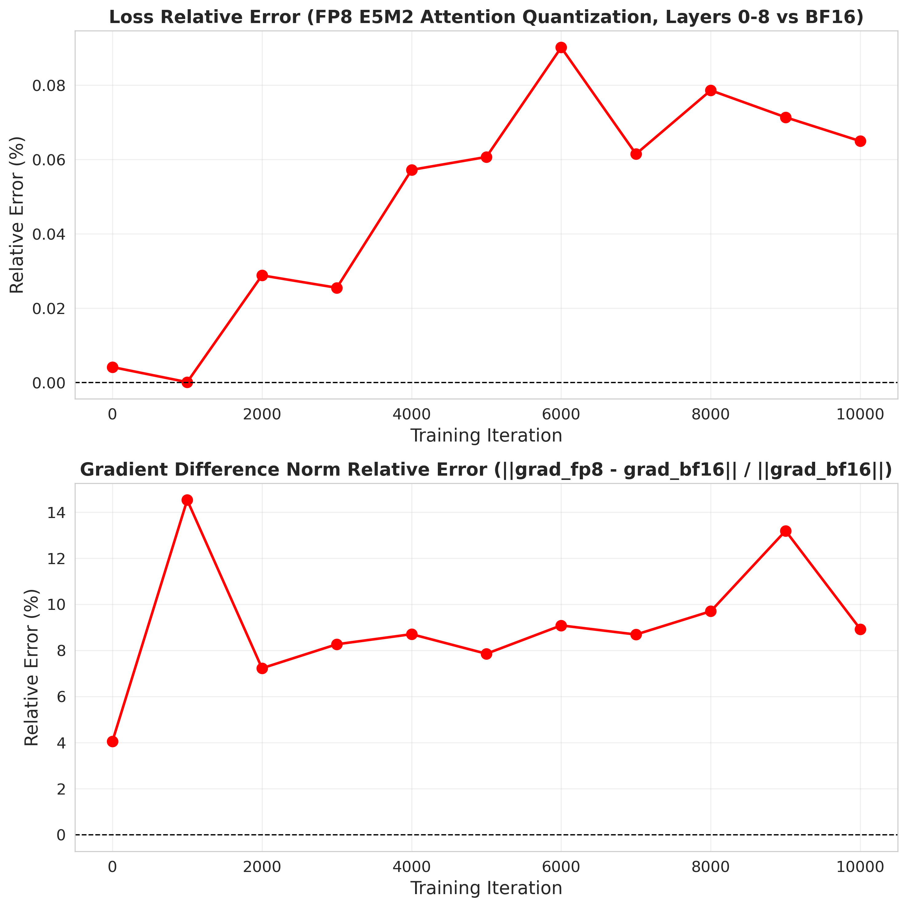

# Precision Effects on Training Dynamics

**Zhao Chenran, The Chinese University of Hong Kong, Shenzhen**

This repository documents my ongoing research on how **FP8 activation quantization** changes training dynamics in a sparse large language model, with a focus on **DeepSeek-MoE-2B** under controlled checkpoint-based BF16/FP8 comparison.

The current March update is not centered on benchmark accuracy or downstream evaluation. Instead, it studies how reduced precision changes:

- loss-level alignment,
- gradient perturbation magnitude,
- relative error over training,
- module-dependent sensitivity,
- and the redistribution of perturbation across parameters.

---

## March 2026 Update: Main Questions

This phase of the project is organized around four empirical questions:

1. **Module sensitivity**  
   Do **MoE** and **Attention** respond differently to the same FP8 activation quantization strategy?

2. **Depth sensitivity**  
   How different are **single-layer quantization** and **continuous multi-layer quantization (layers 0–8)**?

3. **Format sensitivity**  
   Does **E4M3** stay better aligned with BF16 than **E5M2**?

4. **Perturbation redistribution**  
   If the final loss remains well aligned, does the perturbation still migrate across parameters and modules during training?

---

## Model and Training Context

All current results are based on **DeepSeek-MoE-2B**.

### Base training setup
- **Model:** DeepSeek-MoE-2B
- **Training precision:** BF16
- **Optimizer:** AdamW
- **Hardware:** 4 × A100 80GB
- **Parallelism:** DDP
- **Dataset:** C4 English
- **Training horizon shown here:** checkpoints from iter 0 to iter 10000

### Quantization protocol
- **Quantization target:** activations only
- **Weights:** kept in BF16
- **Optimizer state:** kept in FP32
- **Formats:** FP8 E4M3, FP8 E5M2
- **Locations:** MoE final outputs, Attention final outputs
- **Depth settings:** layer-0 only, or continuous quantization across layers 0–8

### Evaluation protocol
For each baseline checkpoint, BF16 and FP8 are evaluated on the **same input batch** with matched forward/backward comparison.  
The main metrics are:

- **Loss**
- **Gradient difference norm** `||grad_fp8 - grad_bf16||`
- **Relative error**
- **Weight norm** (baseline reference)

For sparse MoE comparisons, the global gradient difference norm uses a **union-based** construction over parameter sets, with non-activated parameters zero-filled before the global norm is computed.

---

## Current Takeaways

### 1. Module sensitivity is clearly not uniform
The March results suggest that **Attention** and **MoE** do not exhibit the same perturbation profile under FP8 activation quantization.

- **Attention** is closer to an **early-strong / later-decaying** pattern.
- **MoE** is more consistent with a **bounded but persistent nonzero perturbation** pattern.

This means the same low-precision rule should not be summarized as a single universal behavior across modules.

### 2. E4M3 is generally better aligned with BF16 than E5M2
Within the current setup, **E4M3** consistently appears more stable than **E5M2**.

A cautious reading of the current evidence is:

- **E4M3:** preserves stronger BF16 alignment while keeping perturbations bounded.
- **E5M2:** often still preserves convergence, but under a noisier optimization regime.

### 3. Single-layer and multi-layer quantization are not equivalent
Depth sensitivity is visible, but the visibility depends on the module.

- On **Attention**, the difference between **layer 0 only** and **layers 0–8** is easier to observe.
- On **MoE**, single-layer and multi-layer curves can look close under the current global metric, but they are **not identical**. The gap depends on checkpoint and data window.

So the correct interpretation is **close-but-not-equal**, not "the same result" and not "later layers do nothing."

### 4. Final loss is not enough
A recurring pattern in these experiments is that **loss can remain strongly aligned even when gradient-space perturbation is clearly nonzero**.

This is one of the main motivations for tracking:

- gradient difference norm,
- relative gradient error,
- and parameter-level perturbation ranking.

### 5. Perturbation redistributes across modules during training
Top-ranked `grad_diff_norm` parameters do not remain permanently localized at the directly quantized output.

Instead, the dominant contributors shift during training, which is consistent with a **cross-module redistribution** view of precision-induced perturbation.

This repository therefore treats low-precision effects as a **training-dynamics problem**, not just a final-loss problem.

---

## Selected Figures

## 1. MoE, E4M3, layers 0–8: comprehensive comparison

**Interpretation.**  
This figure summarizes the most representative multi-layer MoE E4M3 setting in one panel.  
The loss remains close to BF16, while the perturbation in gradient space stays nonzero and structurally visible across training.

---

## 2. MoE, E4M3, layer 0 only: loss comparison

**Interpretation.**  
Single-layer MoE quantization does not materially break loss alignment in the current setting.  
This makes it a useful low-perturbation reference when compared with deeper quantization.

---

## 3. MoE, E4M3, layer 0 only: gradient difference norm

**Interpretation.**  
The perturbation is clearly nonzero, but it remains bounded rather than explosively unstable.  
This is consistent with the broader March observation that MoE perturbations can persist even when the scalar loss stays aligned.

---

## 4. MoE, E4M3, layer 0 only: relative error

**Interpretation.**  
Loss relative error remains small, while gradient relative error stays visibly nonzero.  
Again, the key message is that **loss alone under-describes the precision effect**.

---

## 5. Attention, E5M2, layers 0–8: loss comparison

**Interpretation.**  
This figure illustrates a noisier format/module combination.  
Even when the loss is still convergent and close to BF16 in absolute scale, the deviation profile is visibly less well aligned than in the more stable E4M3 settings.

---

## 6. Attention, E5M2, layers 0–8: relative error

**Interpretation.**  
The relative-error view makes the format sensitivity more explicit.  
Compared with E4M3-based settings in the March study, E5M2 is more consistent with a noisier and less BF16-aligned optimization process.

---

## 7. Baseline weight norm reference

**Interpretation.**  
This figure provides the BF16 reference trajectory for parameter-scale evolution over training.  
It is useful as a baseline context when interpreting perturbation experiments, even though the checkpoint-based quantized evaluations here do not themselves update weights.

---

## What Changed Relative to the Earlier README

This March update intentionally shifts the repository away from an earlier emphasis on **gradient-angle narratives** and toward a more stable summary based on:

- **loss-level alignment,**
- **gradient difference norm,**
- **relative error,**
- **module sensitivity,**
- **depth sensitivity,**
- **format sensitivity,**
- and **parameter-level perturbation redistribution**.

The current wording is deliberately more conservative:  
the repository does **not** claim that FP8 directly breaks convergence in this setup.  
Instead, it shows that FP8 can preserve convergence while still changing optimization behavior in structured, measurable ways.

---

## Current Limitations

The current repository should still be read with the following limits in mind:

- Results are based on **fixed checkpoints** and **fixed evaluation windows**, not full end-to-end retraining under every quantized setting.
- Some conclusions are **metric-dependent**, especially for sparse MoE under union-based global gradient norms.
- Parameter-level perturbation migration is currently an **empirical pattern**, not a formal causal proof.
- The present public repository does not include internal infrastructure, full training code, or unreleased project components.

---

## Ongoing Directions

Planned next steps include:

- adding more checkpoint windows and data offsets,
- extending parameter-level analysis into layer/module-level summaries,
- testing whether these perturbations correlate with longer-horizon quality or generalization changes,
- and expanding the study of module-dependent precision sensitivity in sparse architectures.

---

## Repository Scope

This repository focuses on **empirical training-dynamics evidence** rather than polished benchmark reporting.  
The goal is to make precision-induced optimization effects visible, measurable, and interpretable in a controlled systems setting.
