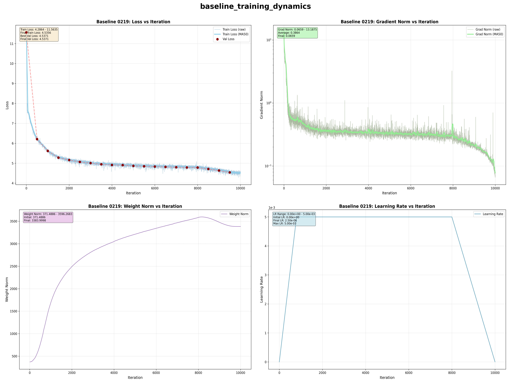
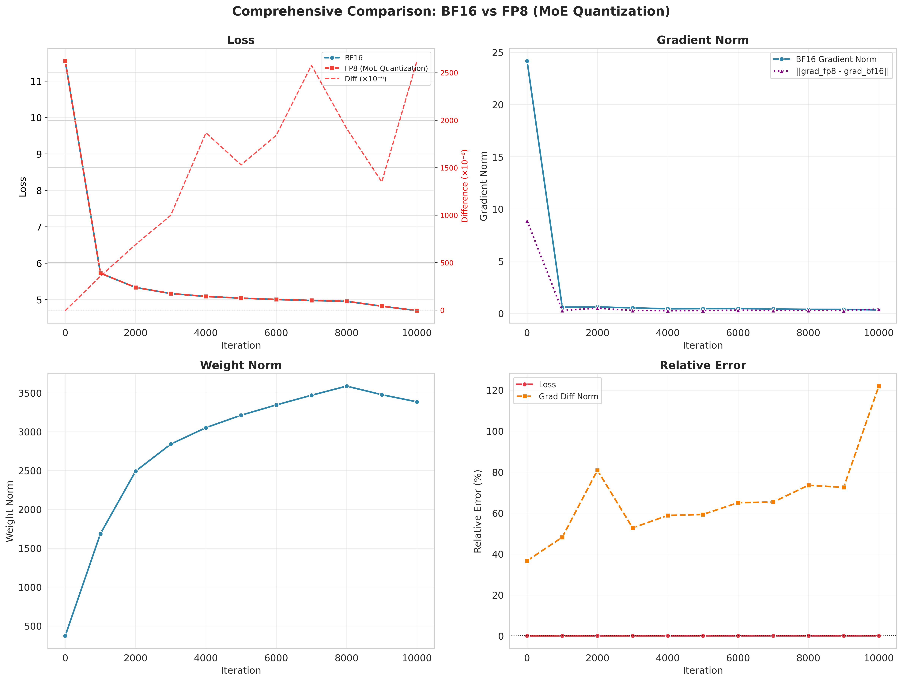
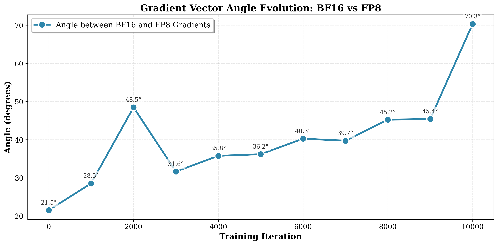
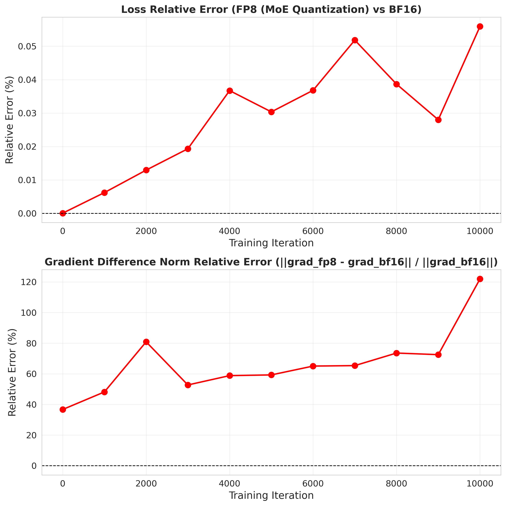
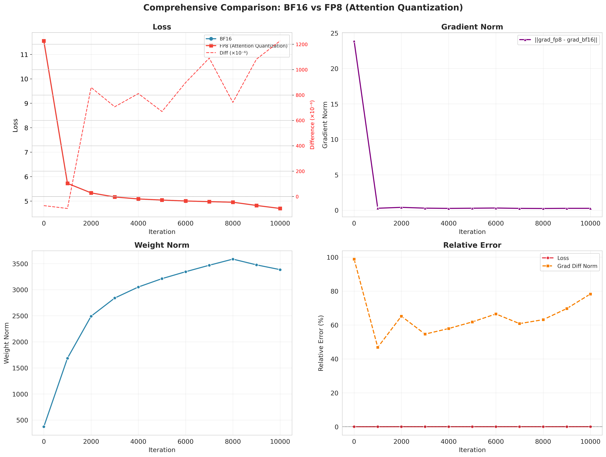
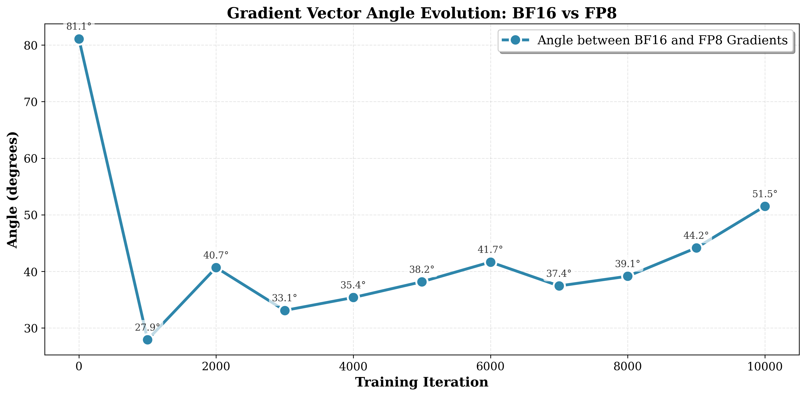
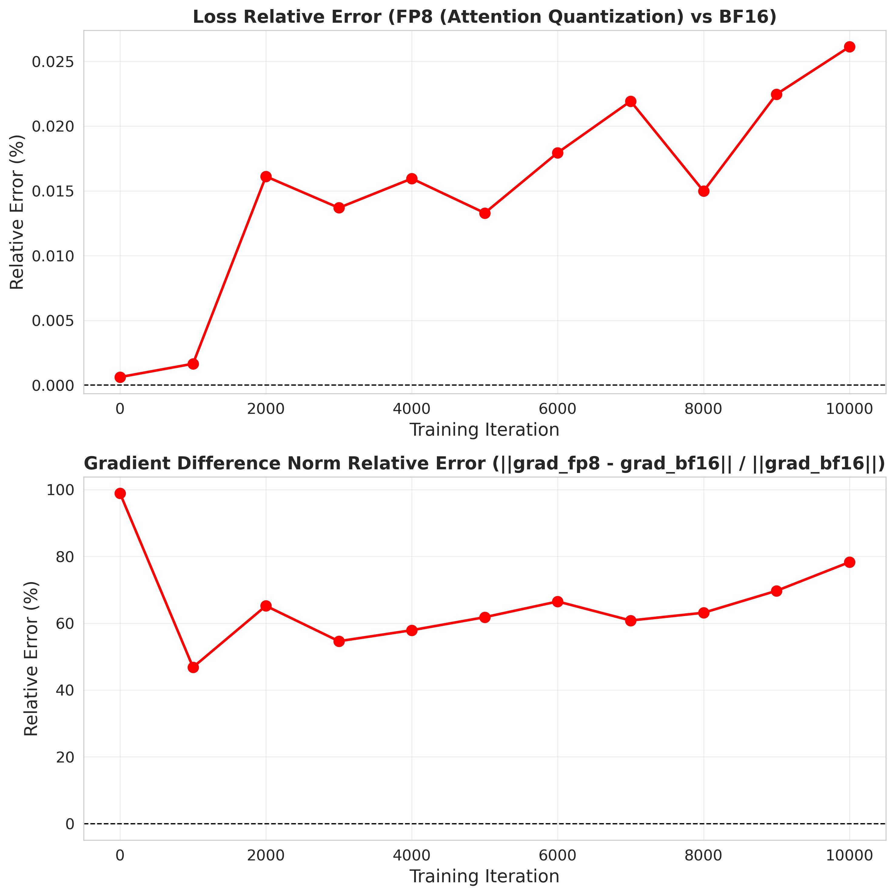

# Precision Effects on Training Dynamics

## Research Theme

This repository documents my ongoing research on how numerical precision and layer-wise activation quantization affect optimization trajectories and training stability in large-scale language models.

Rather than focusing on benchmark performance, this study investigates how reduced precision alters gradient behavior, parameter evolution, and convergence dynamics.

---

## Research Questions

- How does FP8 (E4M3 / E5M2) differ from BF16 in training dynamics?
- Does layer-wise activation quantization shift optimization trajectories?
- Are gradient-related metrics more sensitive than loss for detecting instability?
- How does multi-layer quantization compare with single-layer perturbation?

---

## Experimental Axes

**Precision Format**
- BF16 (baseline)
- FP8 E4M3
- FP8 E5M2

**Quantization Location**
- MoE layers
- MHA layers

**Quantization Depth**
- Single-layer activation quantization
- Multi-layer activation quantization (0–8 layers)

**Metrics Tracked**
- Training loss
- Gradient difference norm
- Relative error
- Gradient direction alignment
- Weight norm
- Learning rate schedule

---

## Key Observations

### 1. Multi-layer Quantization Shifts Optimization Trajectory
Even when loss remains close to baseline, gradient-related metrics show increasing deviation, suggesting trajectory-level changes in optimization.

### 2. Single-layer Quantization Preserves Alignment
Single-layer activation quantization introduces minimal directional deviation, indicating limited impact on global training dynamics.

### 3. E4M3 Aligns More Closely with BF16 than E5M2
E4M3 consistently exhibits smaller gradient deviation and relative error compared to E5M2.

### 4. Loss Alone Is Insufficient as an Early Instability Indicator
Gradient difference norm and directional deviation often increase before noticeable divergence appears in the loss curve.

### 5. Weight Norm Closely Follows Learning Rate Scheduling
Parameter scale evolution strongly correlates with warmup and decay phases, reinforcing the coupling between effective step size and optimization dynamics.

---

# 🔬 Selected Figures and Empirical Findings

---

## 1️⃣ Baseline Training Dynamics (BF16 Reference)

**Observation.**  
Under BF16 precision, loss, gradient norm, and weight norm evolve smoothly and consistently with the learning rate schedule.

**Interpretation.**  
This establishes a stable optimization reference trajectory.  
All subsequent precision perturbations (FP8) are evaluated relative to this baseline to isolate deviations in:

- convergence path  
- gradient geometry  
- parameter scale evolution  

---

# 2️⃣ Multi-layer MoE Quantization (FP8)

---

### (a) Optimization Trajectory Comparison

**Key Insight.**

- Loss remains close to BF16.
- Gradient norm magnitude remains stable.
- Gradient deviation accumulates progressively over iterations.

This suggests FP8 introduces structural gradient perturbations, even when scalar metrics (e.g., loss) appear stable.

---

### (b) Gradient Direction Shift

**Key Insight.**

The gradient vector angle between FP8 and BF16 increases steadily during training.

This indicates:

- Optimization trajectories gradually diverge.
- Perturbations manifest geometrically rather than purely in magnitude.

MoE layers exhibit moderate sensitivity under reduced precision.

---

### (c) Relative Error Evolution

**Key Insight.**

- Loss relative error remains small.
- Gradient difference norm increases significantly.

This decoupling suggests:

> Loss alone is insufficient to detect instability; gradient-based metrics are more sensitive indicators of precision-induced perturbations.

---

# 3️⃣ Multi-layer MHA Quantization (FP8)

---

### (a) Optimization Trajectory Comparison

**Key Insight.**

- Loss remains stable.
- Gradient deviation increases more rapidly compared to MoE.
- Structural perturbation appears stronger in attention layers.

This indicates that MHA layers may be more sensitive to quantization noise.

---

### (b) Gradient Direction Shift

**Key Insight.**

Gradient angle deviation grows faster than in MoE experiments.

This suggests attention layers exhibit higher geometric sensitivity under reduced precision.

---

### (c) Relative Error Evolution

**Key Insight.**

Relative gradient error accumulates steadily over training.

This supports the hypothesis that:

> Structural components (e.g., attention mechanisms) may amplify low-precision perturbations more than MoE feed-forward structures.

---

# 📌 Cross-Module Comparison Summary

| Component | Loss Stability | Gradient Magnitude | Gradient Direction Drift | Sensitivity |
|------------|---------------|-------------------|---------------------------|-------------|
| MoE | Stable | Stable | Moderate | Medium |
| MHA | Stable | Stable | Larger | Higher |

---

# 🔍 Discussion

These experiments suggest that reduced precision primarily perturbs:

- Gradient geometry  
- Optimization trajectory alignment  

rather than immediate scalar loss behavior.

This implies that:

> Training dynamics analysis provides earlier and more sensitive instability signals than loss curves alone.

From an ML systems perspective, this work emphasizes that numerical precision affects not only convergence outcomes, but also the geometric structure of optimization trajectories.

---

## Interpretation and Ongoing Hypotheses

My current interpretation is that reduced precision modifies optimization trajectories before it significantly alters loss convergence.

In particular:
- Gradient-related deviations may serve as earlier instability signals than loss.
- Multi-layer activation quantization accumulates directional bias.
- Numerical format influences effective update behavior even under identical learning rate schedules.

These hypotheses are under ongoing investigation.

---

## Current Limitations

- Spectral analysis of gradient structure is not yet included.
- Full theoretical explanation of trajectory shifts remains open.
- This repository excludes internal infrastructure and unreleased project components.

---

## Future Directions

- Investigate whether gradient alignment metrics can predict divergence.
- Analyze interaction between MoE sparsity and precision.
- Study precision-induced changes in effective learning rate.
- Extend experiments to additional model scales.

---

## Author

Chenran Zhao  
Undergraduate researcher focused on optimization and training dynamics in large-scale ML systems.
